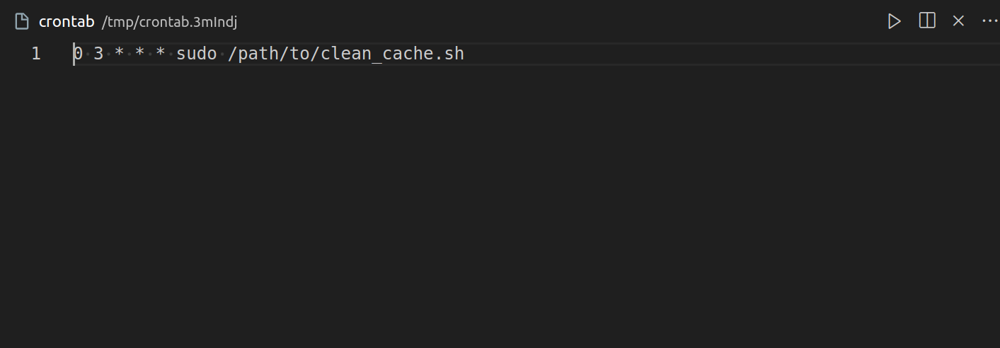
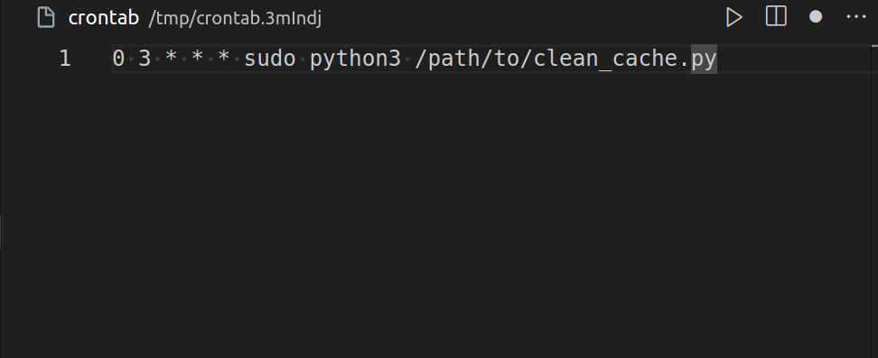

# Overview

## Need and Solution

I created this automation using AI to solve a recurring issue on my Ubuntu system. I was frequently prompted to clear the RAM cache, which required manual terminal commands. To streamline this process and save time, I decided to automate it. Using a generative AI tool, I developed a custom script and received additional recommendations, such as scheduling daily execution via cron and generating a log file to verify that the task completes as scheduled each day.


# Clear Cache and Swap Automation Scripts

This repository contains two scripts (one in Python and one in Bash) that automate the process of clearing the system's RAM cache, buffers, and SWAP memory on a Linux system. These scripts log their actions to a log file for easy review.

## Summary of Contents

1. [Introduction](#introduction): Brief explanation of the scripts and what they do.
2. [Requirements](#requirements): Linux and superuser permissions.
3. [Instructions](#instructions): How to run both the shell and Python scripts, making them executable, and running with `sudo`.
4. [Logs](#logs): Information about where the logs are saved and how to view them.
5. [Scheduling with cron](#scheduling-with-cron): Optional instructions to automate script execution using cron jobs.

## Introduction

This repository contains two scripts (one in Python and one in Bash) that automate the process of clearing the system's RAM cache, buffers, and SWAP memory on a Linux system. These scripts log their actions to a log file for easy review.

##### Scripts Overview

- **`clean_cache.sh`**: Shell script to clear RAM cache, buffers, and SWAP.
- **`clean_cache.py`**: Python script to perform the same actions with logging functionality.

## Requirements

- Linux system (tested on Ubuntu)
- Superuser (`sudo`) permissions

### Actions performed by the scripts:

1. **Clear RAM Cache/Buffer**:
   - Clears file system caches (cache, buffer).
2. **Clear Dentries and Inodes**:
   - Frees up unused directory entries and inode caches.
3. **Clear SWAP**:
   - Disables and re-enables the SWAP space to clear it.

## Instructions

### Bash Script (`clean_cache.sh`)

#### Make the script executable

```bash
chmod u+x clean_cache.sh
```

#### Run the script

```bash
./clean_cache.sh
```

### Python Script (`clean_cache.py`)

#### Install Python (if not installed)

Make sure Python 3 is installed on your system. You can install it using:

```bash
sudo apt update
sudo apt install python3
```

#### Make the script executable

```bash
chmod u+x clean_cache.py
```

#### Run the Python script

```bash
python3 clean_cache.py
```

## Logs

- Both scripts log their actions to a file located in your home directory: ~/clear_cache.log.
- You can manually view the log file using:

```bash
cat ~/clear_cache.log
```

or

```bash
tail -f ~/clear_cache.log  # To see logs in real-time
```

## Scheduling with cron

(Optional)
You can automate the execution of these scripts using cron to run them at specific intervals (e.g., every day at 3 AM).

1. Open the crontab editor:

```bash
crontab -e
```

2. Add a new cron job to execute the script. For example, to run the script daily at 3 AM:

The asterisks represent time and date fields in the order:

    Minute (0–59)
    Hour (0–23)
    Day of the month (1–31)
    Month (1–12)
    Day of the week (0–7, with both 0 and 7 representing Sunday)

```bash
0 3 * * * sudo /path/to/clean_cache.sh
```

example:


For the Python script, you would use:

```bash
0 3 * * * sudo python3 /path/to/clean_cache.py
```

example:


Make sure to replace /path/to/ with the actual path where the script is located.

> [More information about debugging cron jobs](/CronJob-debugging-guide.md)

#### Note

- These scripts require superuser permissions because they interact with system-level resources (e.g., SWAP, cache, and /proc/sys/).
- Use these scripts with caution, especially when clearing SWAP, as it could freeze your system if there's not enough free RAM available.
